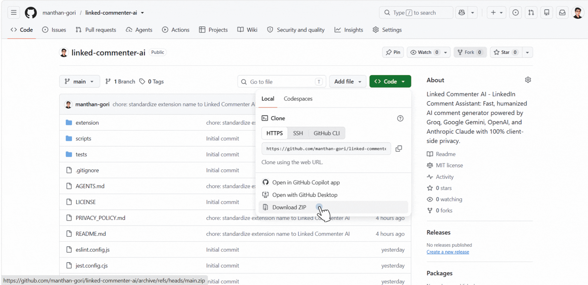

# Linked Commenter AI

[](LICENSE)
[](https://developer.chrome.com/docs/extensions/mv3/)

Linked Commenter AI is a lightweight, privacy-focused Chrome Extension (Manifest V3) that generates intelligent, humanized comments directly within LinkedIn post comment boxes. It connects to leading AI providers (Groq, Google Gemini, OpenAI, and Anthropic Claude) using your own API keys.

---

## Quick Setup (3 Steps)

1. **Install**: Go to `chrome://extensions` in Chrome, turn on **Developer mode** (top right), click **Load unpacked**, and select the `extension/` folder.
2. **Configure**: Click the **LinkedCommenter AI** icon in your toolbar, choose your AI provider (Groq, Gemini, OpenAI, Claude), paste your API key, and click **Save & Test Connection**.
3. **Engage**: Open [LinkedIn](https://www.linkedin.com), click into any comment box, pick your tone, and hit **✨ AI Comment**!

### Demo & Setup Walkthrough

<p align="center">
  
</p>

---

## Features

- **Inline Assistant Bar**: Injects an AI Comment bar directly above focused LinkedIn comment boxes.
- **Multi-Provider and Multi-Model Support**:
  - **Groq Cloud**: `groq/compound-mini`, `groq/compound`, `qwen/qwen3.8-27b`, `allam-2-7b`, `qwen/qwen3.6-27b`, `openai/gpt-oss-120b`, `openai/gpt-oss-20b`
  - **Google Gemini**: `gemini-3.7-flash`, `gemini-3.6-flash`, `gemini-3.5-flash`, `gemini-3.5-flash-lite`, `gemini-3.1-pro-preview`
  - **OpenAI (ChatGPT)**: `gpt-4o-mini`, `gpt-4o`, `gpt-4.5-preview`, `o3-mini`, `o1`, `o1-mini`, `gpt-4-turbo`
  - **Anthropic (Claude)**: `claude-3-7-sonnet`, `claude-3-5-sonnet`, `claude-3-5-haiku`, `claude-3-opus`
- **18 Built-in Tones & Custom Tones**: Customize existing tone instructions or create new custom tones.
- **Persona & Custom Prompting**: Set a global persona (e.g., "Senior Software Architect") to match your personal writing voice.
- **Humanized Output**: Strips em-dashes (`—`), hashtags, buzzwords, and reasoning tags (`<think>`).
- **100% Private & Client-Side**: Direct browser-to-API communication. No backend servers, no analytics, no tracking.

---

## Supported Tones

| Category | Tones | Best Used For |
|---|---|---|
| **Daily Engagement** | Congratulations, Positive Feedback, Appreciation, Agreement, Encouragement | Promotions, project launches, celebrating milestones, creator appreciation |
| **Growth & Discussion** | Valuable Notes, Engagement, Funny Viral | Thought leadership, initiating discussions, conversational insights |
| **Classic & Professional** | Professional, Insightful, Friendly, Casual, Witty, Empathetic, Curious, Motivational, Contrarian, Storytelling | Case studies, industry discussions, perspectives |

---

## Installation

Requirements: Google Chrome or Chromium-based browsers (Brave, Edge, Opera, Arc). No build step required.

1. Clone or download this repository:
   ```bash
   git clone https://github.com/manthan-gori/linked-commenter-ai.git
   ```
2. Open Chrome and navigate to `chrome://extensions`.
3. Enable **Developer mode** in the top-right corner.
4. Click **Load unpacked** and select the `extension/` folder.
5. Pin **LinkedCommenter AI** to your Chrome toolbar.

---

## Configuration

1. **Obtain an API Key from your chosen provider:**
   - Groq Cloud: [console.groq.com](https://console.groq.com)
   - Google Gemini: [aistudio.google.com](https://aistudio.google.com)
   - OpenAI: [platform.openai.com](https://platform.openai.com)
   - Anthropic Claude: [console.anthropic.com](https://console.anthropic.com)
2. **Configure the Extension:**
   - Click the extension icon in your Chrome toolbar.
   - Select your preferred AI Provider.
   - Paste your API key and choose your preferred model.
   - (Optional) Set your Custom Persona Prompt.
   - Click **Save & Test Connection**.

---

## Usage

1. Open [linkedin.com](https://www.linkedin.com).
2. Click into the comment box on any post.
3. Select your desired tone from the dropdown bar above the comment field.
4. Click **AI Comment**.
5. Review and edit the generated response, then click **Post**.

---

## Development & Testing

```bash
# Run unit tests
npm test

# Linting
npm run lint

# Type checking
npm run typecheck
```

---

## Privacy & Security

- All API keys and preferences are stored locally in your browser (`chrome.storage.local`).
- API requests are sent directly from your browser to your selected AI provider.
- Zero analytics, telemetry, or server-side logging.
- See [PRIVACY_POLICY.md](PRIVACY_POLICY.md) for full details.

---

## Author & License

Created by [manthan-gori (Manthan Gori)](https://github.com/manthan-gori).

Distributed under the [MIT License](LICENSE). Copyright (c) 2026 Manthan Gori.
